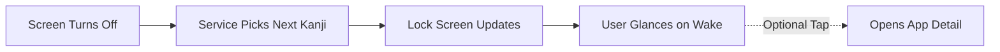
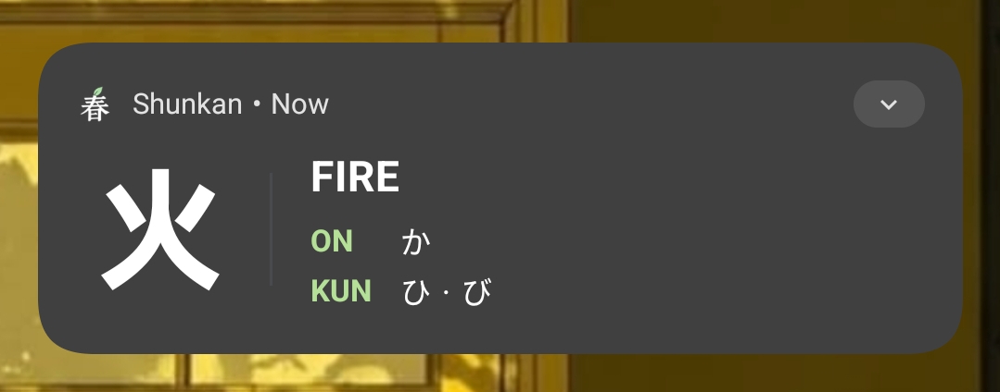
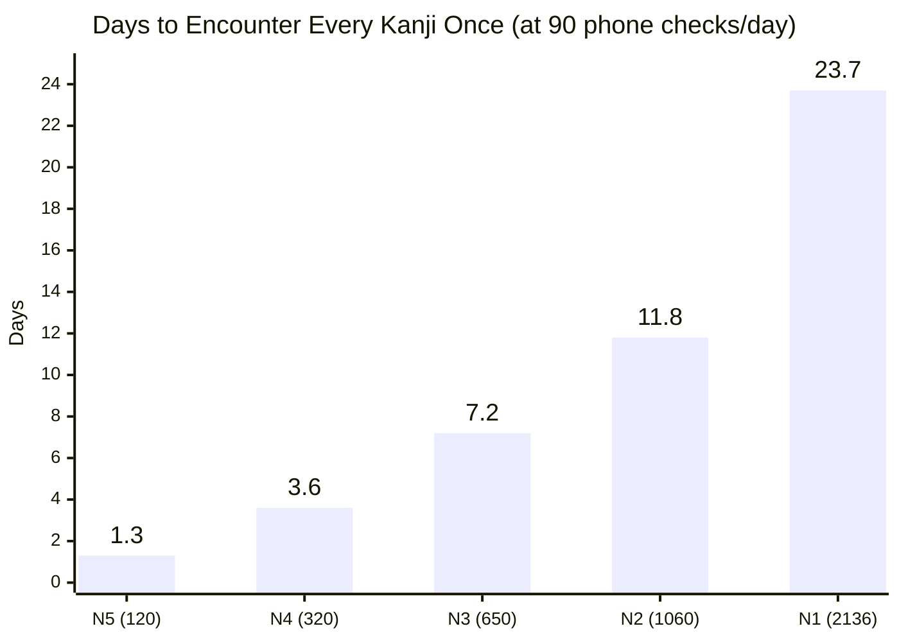

#  Shunkan

An Android passive micro-learning engine built with Flutter and native Kotlin. Shunkan embeds Japanese Kanji flashcards directly into the Android lock screen by intercepting display sleep cycles, turning routine phone checks into automated spaced repetitions.

---

## How It Works



---

## Flashcard Anatomy

<p align="center">
  
</p>

* **Lock-Screen Glance (Collapsed)**:
  * **Kanji & Primary Meaning**: Large high-contrast character and core translation.
  * **Quick Readings**: Essential Onyomi and Kunyomi readings for instant recognition.
* **Expanded View (Swipe down / Open)**:
  * **Additional Readings**: Full reading breakdowns and extended definitions.
  * **Compound Vocabulary**: Real-world word combinations with Furigana.
  * **Direct In-App Deep Link**: Tap to jump directly to the Kanji in the Pool and copy it with one click.

---

## Passive Learning by the Numbers

The average person checks or wakes their phone **70 to 110 times a day**. Shunkan turns each routine glance into an automated spaced review.

> **Current Dataset:** Ships with **320 curated Kanji** covering **JLPT N5 (120 characters)** and **JLPT N4 (200 characters)**.



* **Per glance:** ~2.5 seconds
* **Daily exposure:** 90 checks × 2.5s = **~3.8 minutes of micro-study**
* **Monthly volume:** **~2 hours of spaced repetition** without opening an app or scheduling study sessions.
* **Pool Progression:** N5 (120) → N4 (320) → N3 (650) → N2 (1,060) → N1 (2,136 Joyo)

---

## Android Permissions & OEM Setup

```xml
<uses-permission android:name="android.permission.POST_NOTIFICATIONS"/>
<uses-permission android:name="android.permission.FOREGROUND_SERVICE"/>
<uses-permission android:name="android.permission.FOREGROUND_SERVICE_SPECIAL_USE"/>
<uses-permission android:name="android.permission.RECEIVE_BOOT_COMPLETED"/>
<uses-permission android:name="android.permission.WAKE_LOCK"/>
```

### Why Each Permission is Required

| Permission | Why It's Needed |
| :--- | :--- |
| `POST_NOTIFICATIONS` | Displays the Kanji flashcard on Android 13+ (API 33+). |
| `FOREGROUND_SERVICE` | Keeps the background service alive so Android OS does not kill it. |
| `FOREGROUND_SERVICE_SPECIAL_USE` | Complies with Android 14+ requirements for continuous lock-screen utilities. |
| `RECEIVE_BOOT_COMPLETED` | Automatically restarts the flashcard service after phone reboots. |
| `WAKE_LOCK` | Gives the CPU a few milliseconds during screen-off to render and post the next card before entering deep sleep. |


### Required Device Settings
* **Battery Optimization**: Set app battery policy to **Unrestricted** / **Don't optimize** so Android Doze does not kill the broadcast receiver.
* **Lock Screen Notifications**: Set to **Show all notification content** under system notification settings.
* **OEM Autostart (Xiaomi / OnePlus / Samsung)**: Grant Autostart / Background launch permission in device settings.

---

## Build Commands

```bash
# Run unit tests
flutter test

# Debug run on connected Android device
flutter run

# Build universal release APK
flutter build apk --release

# Build split APKs per ABI (arm64-v8a, armeabi-v7a, x86_64)
flutter build apk --split-per-abi
```
