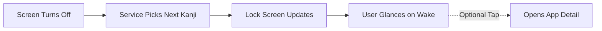
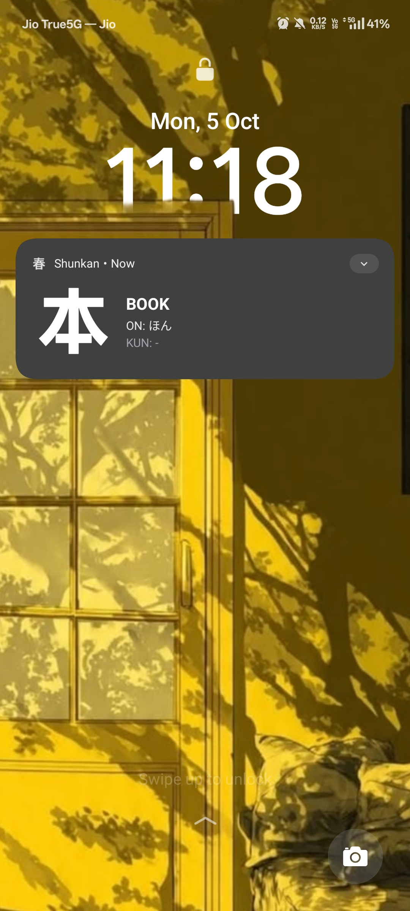
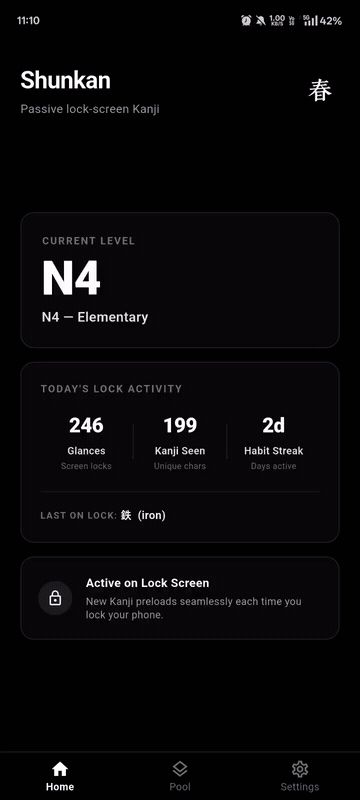
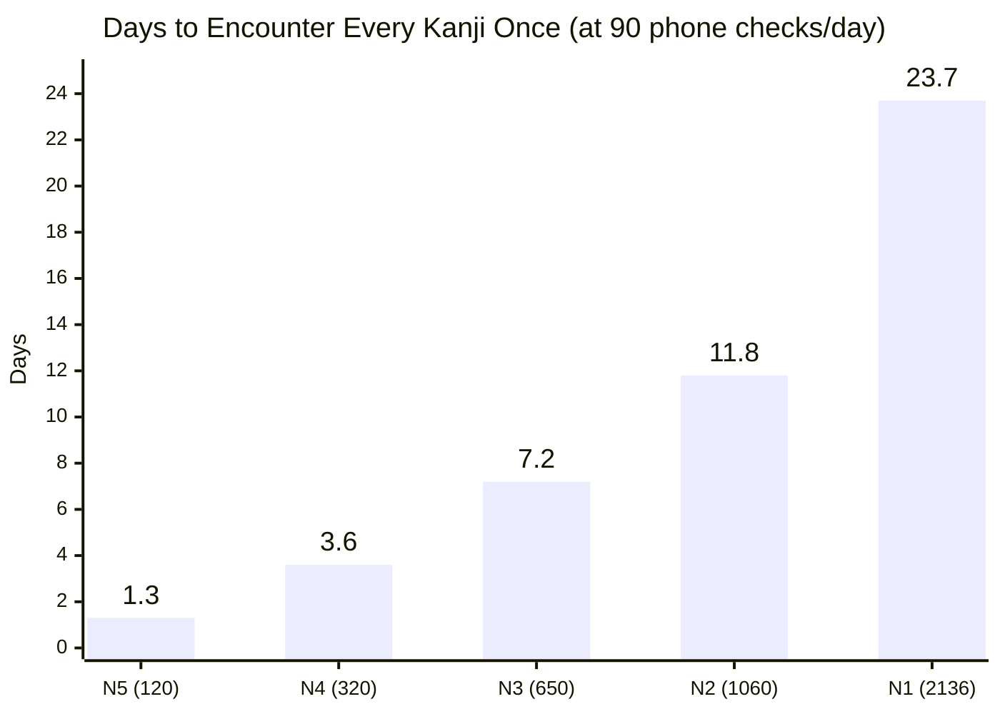

#  Shunkan

An Android passive micro-learning engine built with Flutter and native Kotlin. Shunkan embeds Japanese Kanji flashcards directly into the Android lock screen by intercepting display sleep cycles, turning routine phone checks into automated spaced repetitions.

---

## How It Works



---

## Time-Windowed Catch-Up Shuffle Engine

Shunkan uses an intelligent, unmanipulated **Time-Windowed Catch-Up Deck** running entirely within the native Android background service. Rather than artificially forcing fixed daily review quotas or static frequency buckets, Shunkan scales time windows mathematically by JLPT level and automatically prioritizes missed characters while capping deck size during periods of low activity.

### 1. Mathematical Window Scaling

Each JLPT level has a dedicated time window calibrated against standard daily unlock volumes ($\approx 70$ unlocks/day):

$$\text{Window Duration (Days)} = \left\lceil \frac{\text{Pool Size}}{2 \times \text{Daily Unlocks (70)}} \right\rceil = \left\lceil \frac{\text{Pool Size}}{140} \right\rceil$$

| JLPT Level | Pool Size ($N$) | Window Duration ($W$) | $30\%$ Engagement Threshold |
| :--- | :---: | :---: | :---: |
| **N5** | $\le 150$ (80 active) | **1 Day** (24 hours) | 24 glances |
| **N4** | $\le 450$ (320 active) | **2 Days** (48 hours) | 96 glances |
| **N3** | $\le 850$ (~650 active) | **4 Days** (96 hours) | 195 glances |
| **N2** | $\le 1,500$ (~1,100 active) | **7 Days** (1 week) | 330 glances |
| **N1** | $> 1,500$ (2,136 Joyo) | **14 Days** (2 weeks) | 641 glances |

---

### 2. The $\le 30\%$ Threshold Rule & Deck Generation Formula

At the end of each window cycle (or when the deck is depleted), the engine checks user engagement:

$$\text{Coverage Rate } C = \frac{S}{N} \times 100\%$$

where $S$ is the number of unique Kanji viewed during the window, and $N$ is the total pool size.

$$\text{Generated Deck Size} = \begin{cases} 
N & \text{if } C \le 30\% \quad \text{(Low engagement: flat } 1\times\text{, zero inflation)} \\
2N - S & \text{if } C > 30\% \quad \text{(Active engagement: Seen get } 1\times\text{, Missed get } 2\times\text{)} 
\end{cases}$$

#### Key Mathematical Properties:
1. **Safety Floor ($C \le 30\%$):** If phone usage was low (e.g. busy, sick, or on vacation), missed Kanji are **not** multiplied. The deck generates exactly $N$ cards, preventing deck bloating and unreached card waste.
2. **Absolute Ceiling ($C = 30.1\%$):** The theoretical maximum deck size under any condition is strictly capped at:
   $$\text{Max Peak Cards} = 2N - 0.30N = \mathbf{1.70 \times N}$$
3. **Natural Window 2 Convergence:** Because missed Kanji have $2\times$ density in the second window, they are encountered twice as frequently. By Window 2, overall coverage reaches $>85\%$, naturally bringing the deck size down to $\approx 1.15\times N$.

---

### 3. Deck Generation Model Across User Activity

| JLPT Level | Pool ($N$) | Window ($W$) | Inactive ($\le 30\%$ coverage) | Peak Possible (at $30\%$) | **Typical User** ($65$ glances/day) | Active User ($80$ glances/day) |
| :---: | :---: | :---: | :---: | :---: | :---: | :---: |
| **N5** | **80** | **1 Day** (24h) | **80 cards** | **136 cards** | **95 cards** <br>*(Seen: 65, Missed: 15)* | **80 cards** <br>*(100% full coverage)* |
| **N4** | **320** | **2 Days** (48h) | **320 cards** | **544 cards** | **510 cards** <br>*(Seen: 130, Missed: 190)* | **480 cards** <br>*(Seen: 160, Missed: 160)* |
| **N3** | **650** | **4 Days** (96h) | **650 cards** | **1,105 cards** | **1,040 cards** <br>*(Seen: 260, Missed: 390)* | **980 cards** <br>*(Seen: 320, Missed: 330)* |
| **N2** | **1,100** | **7 Days** (1 Week) | **1,100 cards** | **1,870 cards** | **1,745 cards** <br>*(Seen: 455, Missed: 645)* | **1,640 cards** <br>*(Seen: 560, Missed: 540)* |
| **N1** | **2,136** | **14 Days** (2 Weeks) | **2,136 cards** | **3,631 cards** | **3,362 cards** <br>*(Seen: 910, Missed: 1,226)* | **3,152 cards** <br>*(Seen: 1,120, Missed: 1,016)* |

---

## Flashcard Anatomy

| Lock Screen Trigger | In-App Experience |
| :---: | :---: |
|  |  |
| *Passive glance on wake* | *In-app pool, details & copy* |

* **Lock-Screen Glance (Collapsed)**:
  * **Kanji & Primary Meaning**: Large high-contrast character and core translation.
  * **Quick Readings**: Essential Onyomi and Kunyomi readings for instant recognition.
* **Expanded View (Swipe down / Open)**:
  * **Additional Readings**: Full reading breakdowns and extended definitions.
  * **Compound Vocabulary**: Real-world word combinations with Furigana.
  * **Direct In-App Deep Link**: Tap to jump directly to the Kanji in the Pool and copy it with one click.

---

## Passive Learning by the Numbers

The average person checks or wakes their phone **70 to 110 times a day**. Shunkan turns each routine glance into an automated spaced review.

> **Current Dataset:** Ships with **320 curated Kanji** covering **JLPT N5 (120 characters)** and **JLPT N4 (200 characters)**.



* **Per glance:** ~2.5 seconds
* **Daily exposure:** 90 checks × 2.5s = **~3.8 minutes of micro-study**
* **Monthly volume:** **~2 hours of spaced repetition** without opening an app or scheduling study sessions.
* **Pool Progression:** N5 (120) → N4 (320) → N3 (650) → N2 (1,060) → N1 (2,136 Joyo)

---

## Android Permissions & OEM Setup

```xml
<uses-permission android:name="android.permission.POST_NOTIFICATIONS"/>
<uses-permission android:name="android.permission.FOREGROUND_SERVICE"/>
<uses-permission android:name="android.permission.FOREGROUND_SERVICE_SPECIAL_USE"/>
<uses-permission android:name="android.permission.RECEIVE_BOOT_COMPLETED"/>
<uses-permission android:name="android.permission.WAKE_LOCK"/>
```

### Why Each Permission is Required

| Permission | Why It's Needed |
| :--- | :--- |
| `POST_NOTIFICATIONS` | Displays the Kanji flashcard on Android 13+ (API 33+). |
| `FOREGROUND_SERVICE` | Keeps the background service alive so Android OS does not kill it. |
| `FOREGROUND_SERVICE_SPECIAL_USE` | Complies with Android 14+ requirements for continuous lock-screen utilities. |
| `RECEIVE_BOOT_COMPLETED` | Automatically restarts the flashcard service after phone reboots. |
| `WAKE_LOCK` | Gives the CPU a few milliseconds during screen-off to render and post the next card before entering deep sleep. |


### Required Device Settings
* **Battery Optimization**: Set app battery policy to **Unrestricted** / **Don't optimize** so Android Doze does not kill the broadcast receiver.
* **Lock Screen Notifications**: Set to **Show all notification content** under system notification settings.
* **OEM Autostart (Xiaomi / OnePlus / Samsung)**: Grant Autostart / Background launch permission in device settings.

---

## Build Commands

```bash
# Run unit tests
flutter test

# Debug run on connected Android device
flutter run

# Build universal release APK
flutter build apk --release

# Build split APKs per ABI (arm64-v8a, armeabi-v7a, x86_64)
flutter build apk --split-per-abi
```
